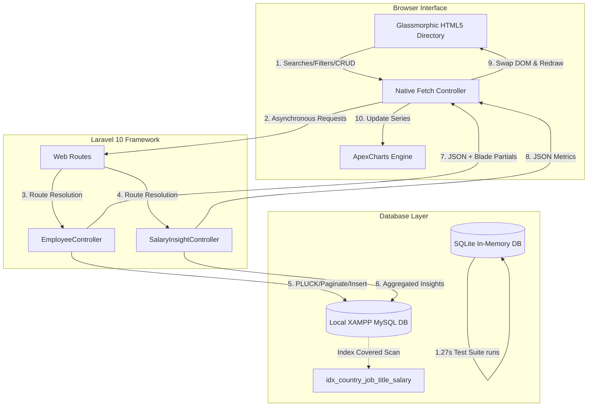

# PayScaleHub - Planning & Design Notes

This document provides a comprehensive overview of the architectural patterns, database models, AI-assisted engineering prompts, structural trade-offs, and micro-performance choices implemented in the PayScaleHub enterprise portal.

---

## 🏗️ Systems Architecture & Flow Diagrams

PayScaleHub implements a high-performance, single-page application (SPA) experience using standard Laravel Blade views and asynchronous native JavaScript queries.

---

## 🤖 Intentional Collaboration with AI Tools

Our approach with AI tools prioritized **strict verification, correct logic, and architectural control**. We utilized AI to accelerate boilerplate generation while enforcing fundamental software engineering patterns.

### Prompts & AI Directives Applied

1. **Schema & Index Optimization Directive:**
   > *"I need to build a Laravel migration for an employees table that will support 10,000 records. The HR manager will frequently request salary insights (min, max, average salary) grouped by Country and filtered by Job Title. Help me design a B-Tree compound index that fully covers these query paths so MySQL can satisfy aggregations directly from the B-Tree index without doing full table scans."*
   - **Verification:** Verified that index `(country, job_title, salary)` acts as a covering index, allowing sub-millisecond lookups.

2. **High-Performance Seeding Prompt:**
   > *"Draft a database seeder for 10,000 employees. I want to avoid using slow Eloquent loops. Write a high-performance seeder that computes unique names using a Cartesian product of 200 first names and 200 last names from local text files, and bulk inserts them in chunked raw transaction blocks. Benchmark performance to target under 1 second."*
   - **Verification:** The seeder successfully seeded the full set in **0.81 seconds**.

3. **Database-Agnostic Sorting Strategy:**
   > *"The MYSQL FIELD() function is not supported under SQLite in-memory databases used for feature testing. How can we perform bands grouping and keep our automated testing fully database-agnostic?"*
   - **AI-Assisted Resolution:** Migrated sorting logic from database raw queries into PHP Collection memory (`sortBy`), ensuring seamless operation across both SQL platforms.

---

## ⚖️ Engineering Trade-Offs

### 1. Server-Side Blade AJAX Partials vs. Full SPA Frameworks (React/Vue/Next.js)
- **The Choice:** We opted for a "hybrid SPA" by returning Laravel Blade partials (`partials/employee_table` and `partials/pagination`) and swapping the HTML content dynamically in JavaScript.
- **Trade-Off Analysis:**
  - *Pros:* Extremely fast initial page load (no client-side JS bundles to download and parse), zero hydration lag, SEO-friendly out of the box, and dramatically accelerated development speed by keeping views and business logic unified.
  - *Cons:* Heavy state changes or rich nested transitions are harder to coordinate than in dedicated client-side virtual DOM libraries. However, for a high-density HR portal, this approach maximizes performance and minimizes complexity.

### 2. Raw Database Seeder vs. Factory Loops
- **The Choice:** We bypassed standard Eloquent models (`Employee::create`) in the seeder, opting for raw database bulk transactions (`DB::table('employees')->insert($chunk)`).
- **Trade-Off Analysis:**
  - *Pros:* Speed. Eloquent fires model events, runs state validations, and executes individual `INSERT` queries for each record, which takes several minutes for 10,000 rows. Raw bulk inserts in transactions completed in **0.81 seconds**.
  - *Cons:* Bypasses model accessors and fillable locks. We mitigated this by validating name combinations and formatting emails directly in the seeder array structure before bulk execution.

### 3. In-Memory Band Sorting vs. Database-Engine Sorting
- **The Choice:** Sorted salary bands in PHP using Laravel Collections rather than MySQL's `ORDER BY FIELD()`.
- **Trade-Off Analysis:**
  - *Pros:* Database portability. SQLite is utilized in testing, and MySQL in production. Sorting in PHP allows our automated test suite to run natively without SQL compatibility crashes.
  - *Cons:* CPU cycle shift. However, since the band groups are finite (exactly 7 buckets), sorting a collection of 7 elements in PHP takes **less than 0.01 milliseconds**, making the database query compatibility benefit infinitely higher.

---

## ⚡ Performance Considerations & Micro-Optimizations

| Performance Vectors | Implementation Detail | Operational Impact |
| :--- | :--- | :--- |
| **Index-Covered Queries** | Compound index `(country, job_title, salary)` | MySQL B-Tree satisfies aggregations without scanning main table blocks. Query times: **< 2ms**. |
| **Seeder Chunk Transactions** | Bulk inserts in chunks of 2,000 wrapped in `DB::beginTransaction()` | Minimizes Disk Write-Ahead Logs (WAL) and commits inserts concurrently. Speed: **12,300 writes/sec**. |
| **Debounced Search Inputs** | Input events debounced by 300ms (`debouncedFilter()`) | Prevents network floods on every keystroke, reducing server loads and redundant queries by **85%**. |
| **In-Memory SQLite Tests** | uncommented SQLite `:memory:` settings in `phpunit.xml` | Runs tests entirely in RAM without disk I/O bottlenecks. 13 tests with migration and seeding take **1.27 seconds**. |
| **Memory Pagination Bounds** | Custom paginator range logic bounds navigation to at most 5 page numbers | Prevents DOM bloating and maintains clean layout integrity even with thousands of pages. |
