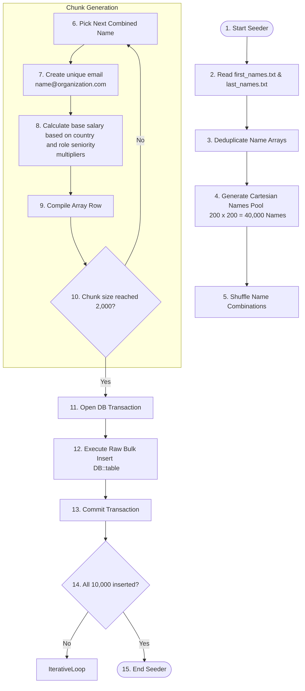
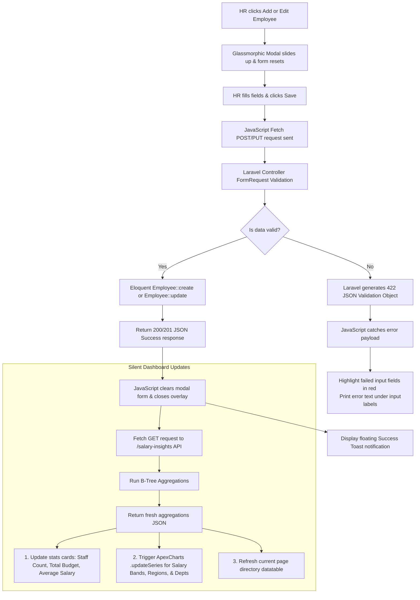
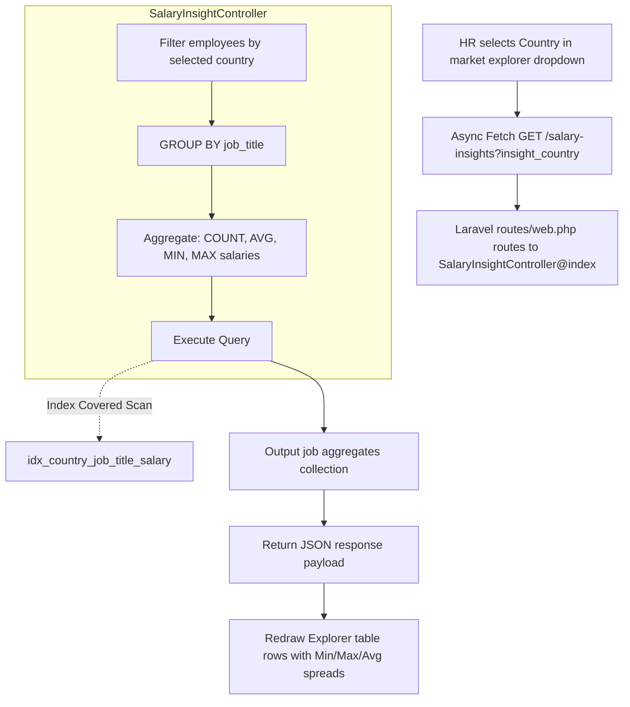

# PayScaleHub - Project Flow Diagrams

This document contains high-fidelity Mermaid flowcharts outlining the sequential data, routing, and user interface flows across all core PayScaleHub operations.

---

## 1. High-Performance Cartesian Seeding Flow

This flowchart illustrates the initialization and database insertion process of the `EmployeeSeeder` class, completing 10,000 unique records in under a second.



---

## 2. Asynchronous Search, Filtering & Pagination Flow

This flowchart shows the execution pipeline when the HR Manager types in the search bar or changes any filter criteria, resulting in a zero-reload dynamic search.

```mermaid
graph TD
    UI[HR types in Search or modifies filter dropdown] --> Debounce[300ms Debouncer <br/> debouncedFilter]
    Debounce --> Fetch[Async native Fetch GET request sent]
    Fetch --> Route[Laravel routes/web.php routes to index]
    
    subgraph Controller Query [EmployeeController@index]
        ParseParams[Parse Search, Country, Dept, and Job parameters] --> CheckSearch{Is search active?}
        CheckSearch -- Yes --> QuerySearch[Apply SQL search clauses]
        CheckSearch -- No --> CheckFilters{Are filters active?}
        QuerySearch --> CheckFilters
        CheckFilters -- Yes --> QueryFilters[Apply SQL filter clauses]
        CheckFilters -- No --> Sort[Apply sort order & page index]
        QueryFilters --> Sort
        Sort --> DB[Execute SQL Query]
    end
    
    DB -.->|Covering B-Tree Index Scan| Index[idx_country_job_title_salary]
    DB --> Output[Paginated Employee Collection]
    
    subgraph Server-Side Rendering
        Output --> RenderTable[Render Blade partial: partials/employee_table]
        Output --> RenderPagination[Render Blade partial: partials/pagination]
    end
    
    RenderTable --> JSON[Return JSON response with HTML blocks]
    RenderPagination --> JSON
    JSON --> Client[JavaScript receives JSON payload]
    Client --> Inject[Swap tbody.innerHTML & paginationWrapper.innerHTML]
    Inject --> ResetOpacity[Reset container opacity to 1.0]
```

---

## 3. Interactive AJAX CRUD Flow

This flowchart describes the record creation/update process, dynamic server validation handling, and background dashboard re-aggregation.



---

## 4. Regional Job Market Explorer Flow

This flowchart outlines the live analytical aggregation requested when changing target markets in the regional explorer widget.


